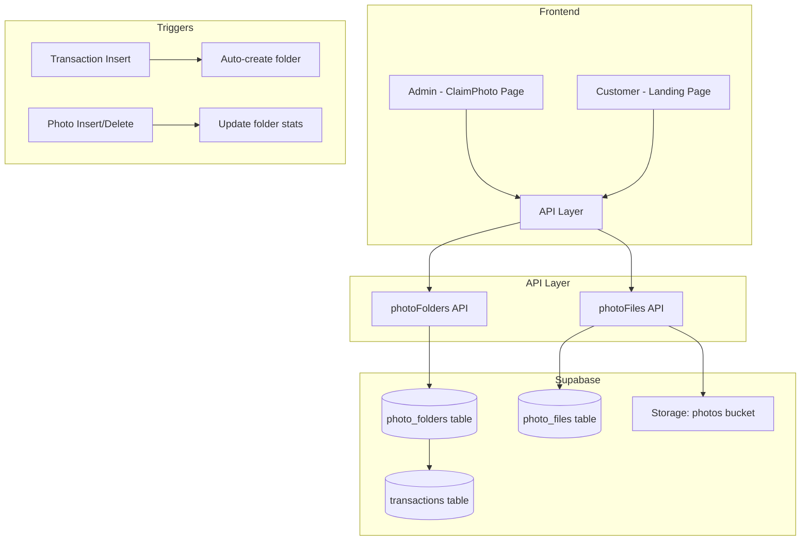

# Design Document: Claim Photo System

## Overview

Sistem Claim Photo untuk SnapMe Studio yang memungkinkan:
1. **Admin Flow**: Mengelola folder foto, upload foto hasil sesi, dan tracking status delivery
2. **Customer Flow**: Search dan download foto via landing page menggunakan nama/nomor HP

Sistem terintegrasi dengan transaksi kasir (auto-create folder) dan menggunakan Supabase Storage untuk penyimpanan foto dengan signed URLs untuk keamanan.

## Architecture



## Components and Interfaces

### 1. Database Tables

#### photo_folders
```sql
CREATE TABLE public.photo_folders (
  id uuid PRIMARY KEY DEFAULT gen_random_uuid(),
  folder_path text UNIQUE NOT NULL,
  folder_name text NOT NULL,
  transaction_id uuid REFERENCES transactions(id) ON DELETE SET NULL,
  customer_name text NOT NULL,
  customer_phone text NOT NULL,
  customer_email text,
  package_name text,
  status text DEFAULT 'pending' CHECK (status IN ('pending', 'ready', 'claimed')),
  photo_count integer DEFAULT 0,
  total_size bigint DEFAULT 0,
  uploaded_by uuid REFERENCES users(id),
  uploaded_at timestamptz,
  claimed_at timestamptz,
  created_at timestamptz DEFAULT now(),
  updated_at timestamptz DEFAULT now()
);

CREATE INDEX idx_photo_folders_phone ON photo_folders(customer_phone);
CREATE INDEX idx_photo_folders_name ON photo_folders(customer_name);
CREATE INDEX idx_photo_folders_status ON photo_folders(status);
CREATE INDEX idx_photo_folders_transaction ON photo_folders(transaction_id);
```

#### photo_files
```sql
CREATE TABLE public.photo_files (
  id uuid PRIMARY KEY DEFAULT gen_random_uuid(),
  folder_id uuid NOT NULL REFERENCES photo_folders(id) ON DELETE CASCADE,
  file_name text NOT NULL,
  file_path text NOT NULL,
  file_size bigint NOT NULL,
  file_type text,
  width integer,
  height integer,
  uploaded_by uuid REFERENCES users(id),
  uploaded_at timestamptz DEFAULT now(),
  download_count integer DEFAULT 0,
  last_downloaded_at timestamptz,
  is_active boolean DEFAULT true,
  created_at timestamptz DEFAULT now()
);

CREATE INDEX idx_photo_files_folder ON photo_files(folder_id);
```

#### Update transactions table
```sql
ALTER TABLE transactions ADD COLUMN IF NOT EXISTS customer_phone text;
```

### 2. Storage Structure

```
photos/                          # Private bucket
├── transactions/
│   └── {transaction_id}/
│       └── {YYYY-MM-DD_CustomerName_Phone}/
│           └── {timestamp}-{random}.jpg
└── manual/
    └── {YYYY-MM-DD_CustomerName_Phone}/
        └── {timestamp}-{random}.jpg
```

### 3. React Components

#### Admin Components
- `src/pages/ClaimPhoto.js` - Main admin page
- `src/components/claimPhoto/FolderList.js` - List folders with filters
- `src/components/claimPhoto/FolderDetail.js` - Folder detail & photo grid
- `src/components/claimPhoto/PhotoUpload.js` - Drag-drop upload with progress
- `src/components/claimPhoto/CreateFolderModal.js` - Manual folder creation

#### Customer Components (Landing)
- `src/pages/LandingClaimPhoto.js` - Public claim page
- `src/components/claimPhoto/ClaimSearch.js` - Search by phone/name
- `src/components/claimPhoto/PhotoGallery.js` - Photo grid with lightbox
- `src/components/claimPhoto/DownloadOptions.js` - Single/bulk download

### 4. API Functions

#### photoFolders.js
```javascript
// Core functions
createPhotoFolder(folderData)      // Create new folder
getPhotoFolders(filters)           // List with filters
getPhotoFolderById(id)             // Get single folder
searchPhotoFolders(term, type)     // Search by phone/name
updateFolderStatus(id, status)     // Update status
deletePhotoFolder(id)              // Delete folder

// Serialization
serializeFolderData(folder)        // Object → JSON string
deserializeFolderData(json)        // JSON string → Object
```

#### photoFiles.js
```javascript
uploadPhoto(folderId, file, onProgress)     // Single upload
uploadMultiplePhotos(folderId, files)       // Batch upload
getPhotosByFolder(folderId)                 // List photos
getPhotoDownloadUrl(filePath, expiresIn)    // Get signed URL
deletePhoto(fileId)                         // Delete photo
incrementDownloadCount(fileId)              // Track downloads
```

## Data Models

### PhotoFolder
```typescript
interface PhotoFolder {
  id: string;
  folderPath: string;
  folderName: string;
  transactionId?: string;
  customerName: string;
  customerPhone: string;
  customerEmail?: string;
  packageName?: string;
  status: 'pending' | 'ready' | 'claimed';
  photoCount: number;
  totalSize: number;
  uploadedBy?: string;
  uploadedAt?: Date;
  claimedAt?: Date;
  createdAt: Date;
  updatedAt: Date;
}
```

### PhotoFile
```typescript
interface PhotoFile {
  id: string;
  folderId: string;
  fileName: string;
  filePath: string;
  fileSize: number;
  fileType: string;
  width?: number;
  height?: number;
  uploadedBy?: string;
  uploadedAt: Date;
  downloadCount: number;
  lastDownloadedAt?: Date;
  isActive: boolean;
  createdAt: Date;
}
```

### FolderMetadata (for serialization)
```typescript
interface FolderMetadata {
  folderId: string;
  customerName: string;
  customerPhone: string;
  customerEmail?: string;
  packageName?: string;
  transactionId?: string;
  createdAt: string;
}
```

## Correctness Properties

*A property is a characteristic or behavior that should hold true across all valid executions of a system-essentially, a formal statement about what the system should do. Properties serve as the bridge between human-readable specifications and machine-verifiable correctness guarantees.*

### Property 1: Folder Creation Validation
*For any* folder creation attempt, if customer_name or customer_phone is empty/missing, the creation SHALL be rejected with validation error.
**Validates: Requirements 1.4**

### Property 2: Photo Count Consistency on Upload
*For any* successful photo upload to a folder, the folder's photo_count SHALL increase by exactly 1.
**Validates: Requirements 2.3**

### Property 3: Photo Count Consistency on Delete
*For any* photo deletion from a folder, the folder's photo_count SHALL decrease by exactly 1 (minimum 0).
**Validates: Requirements 2.5**

### Property 4: File Validation
*For any* file upload attempt, if file type is not in [image/jpeg, image/png, image/webp] OR file size exceeds 10MB, the upload SHALL be rejected.
**Validates: Requirements 2.1**

### Property 5: Search Results Matching
*For any* search query by phone number, all returned folders SHALL have customer_phone containing the search term. *For any* search query by name, all returned folders SHALL have customer_name containing the search term (case-insensitive).
**Validates: Requirements 3.2, 3.3**

### Property 6: Search Results Status Filter
*For any* customer search, all returned folders SHALL have status 'ready' or 'claimed' (never 'pending').
**Validates: Requirements 3.2**

### Property 7: Download Count Increment
*For any* photo download action, the photo's download_count SHALL increase by exactly 1.
**Validates: Requirements 4.5**

### Property 8: Signed URL Expiry
*For any* generated signed URL, the expiry time SHALL be set to 3600 seconds (1 hour).
**Validates: Requirements 4.6**

### Property 9: Auto-Create Folder from Transaction
*For any* completed transaction with customer_phone AND at least one studio item, a Photo_Folder SHALL be created with status 'pending' and package_name matching the studio item.
**Validates: Requirements 5.2, 5.3, 5.4**

### Property 10: Status Transition on First Upload
*For any* folder with status 'pending', uploading the first photo SHALL change status to 'ready'.
**Validates: Requirements 7.2**

### Property 11: Claimed Timestamp Recording
*For any* folder status change to 'claimed', the claimed_at field SHALL be set to current timestamp.
**Validates: Requirements 7.3**

### Property 12: Folder Metadata Round-Trip
*For any* valid FolderMetadata object, serializing to JSON then deserializing SHALL produce an equivalent object.
**Validates: Requirements 8.3**

### Property 13: Storage Path Structure
*For any* uploaded photo, the file_path SHALL follow pattern: `photos/{source_type}/{source_id}/{folder_name}/{filename}` where source_type is 'transactions' or 'manual'.
**Validates: Requirements 6.3**

## Error Handling

### Upload Errors
- File too large → Show error, allow retry
- Invalid file type → Show error, skip file
- Storage error → Show error, allow retry
- Network timeout → Show error, allow retry

### Search Errors
- No results → Show friendly message with suggestions
- Network error → Show retry option
- Invalid input → Show validation message

### Database Errors
- Constraint violation → Show specific error
- Connection error → Show retry option
- Timeout → Show retry option

## Testing Strategy

### Unit Testing
- Test folder creation validation
- Test file type/size validation
- Test search query building
- Test status transition logic
- Test serialization/deserialization

### Property-Based Testing
Library: **fast-check** (JavaScript PBT library)

Configuration:
- Minimum 100 iterations per property
- Seed logging for reproducibility

Property tests will cover:
1. Folder validation (Property 1)
2. Photo count consistency (Properties 2, 3)
3. File validation (Property 4)
4. Search matching (Properties 5, 6)
5. Download tracking (Property 7)
6. Signed URL generation (Property 8)
7. Auto-create logic (Property 9)
8. Status transitions (Properties 10, 11)
9. Round-trip serialization (Property 12)
10. Path structure (Property 13)

Each property-based test MUST:
- Be tagged with format: `**Feature: claim-photo, Property {number}: {property_text}**`
- Run minimum 100 iterations
- Use smart generators that constrain to valid input space
